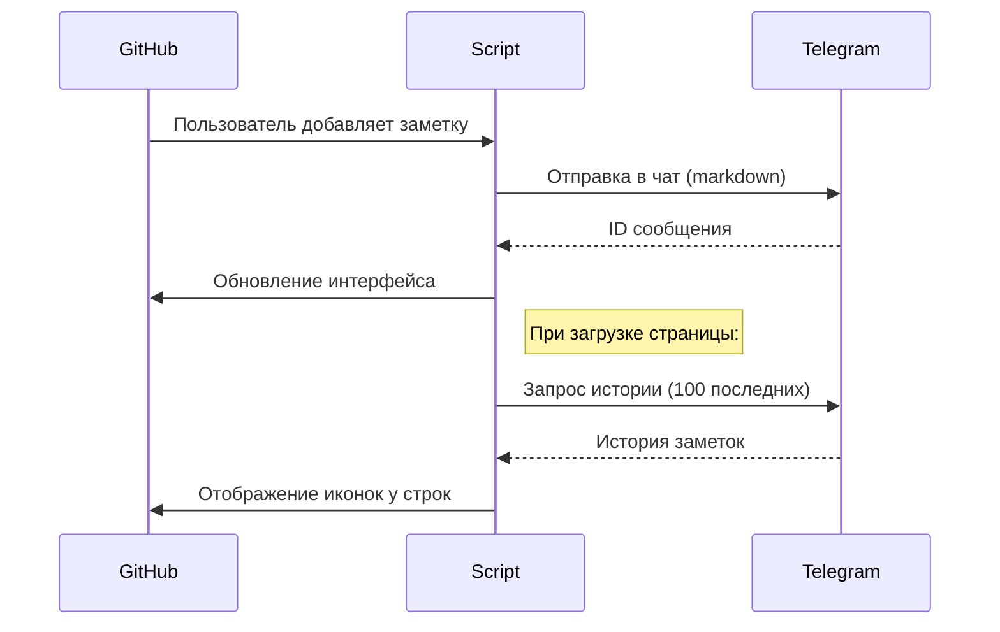
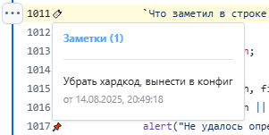
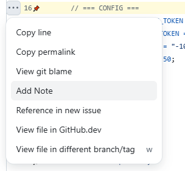

# GitHub Notes to Telegram

**Интерактивные заметки к строкам кода прямо в интерфейсе GitHub** с синхронизацией в Telegram

> "Фиксирую мысли при code review — возвращаюсь к ним позже с любого устройства"

## ✨ Возможности

1. **Кнопка-закладка** 📌 или 🔖 рядом с каждой строкой кода
   - При наведении показывает существующие заметки
   - Клик → добавить новую заметку

2. **Контекстное меню**  
   Новый пункт "Add Note" в меню строки

3. **История заметок**  
   - Автоматическая загрузка последних 100 заметок при старте
   - Отображение в удобном формате (текст + ссылка + метаданные)

4. **Telegram-интеграция**  
   - Все заметки дублируются в указанный Telegram-канал
   - Форматированные сообщения с прямой ссылкой на код

## ⚠️ Ограничения
- При открытии страницы: подгружають только последние 100 заметок  
- Новые заметки с этого устройства появляются сразу  
- Заметки с других устройств — после перезагрузки страницы 
- Полная история всегда доступна в Telegram

## 🛠 Установка

1. Создайте канал и двух ботов. Сделайте их администраторами канала.
2. Установите менеджер userscript'ов ([Tampermonkey](https://www.tampermonkey.net/faq.php#Q406))
3. [Добавьте скрипт](user-js/github-telegram-notes.js)
4. Настройте конфигурацию:
   ```js
   // Получить у @BotFather
   const TELEGRAM_HISTORY_TOKEN = "токен_бота_для_чтения"; 
   const TELEGRAM_ACTION_TOKEN = "токен_бота_для_отправки";
   
   // ID канала (например -1001234567890)
   const TELEGRAM_CHAT_ID = "ваш_channel_id"; 
   ```

## 🔄 Как это работает



## 💡 Пример использования

1. Заметил проблему в коде → клик на 📌
2. Ввёл комментарий:  
   `"Убрать хардкод, вынести в конфиг"`
3. Получил в Telegram:
   ```
   📌 Заметка в коде
   🔹 Репозиторий: owner/repo
   📎 Файл: src/config.js
   🔢 Строка: 42
   🔗 Ссылка: [github.com/.../config.js#L42]
   
   Убрать хардкод, вынести в конфиг
   ```

## 📌 Интерфейс

| Элемент | Описание |
|---------|----------|
| 📌 | Иконка меняется на 🔖 при наличии заметок |
|  | Всплывающее окно с историей заметок |
|  | Пункт "Add Note" в контекстном меню строки |

## 🔐 Безопасность

- Работает **только на github.com**
- Использует **официальное Telegram API**
- Не требует доступа к аккаунту GitHub
- Токены хранятся **только в вашем браузере**

> Скрипт не имеет серверной части — все данные идут напрямую в Telegram
